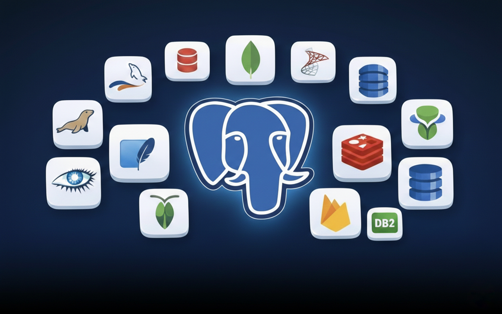

    <picture>
      <source media="(prefers-color-scheme: light)" srcset="banner.jpeg" />
      
  </picture>

  <h1>PostgreSQL Learning Repository</h1>
  

    A repository to track my PostgreSQL + SQL learning journey with notes, queries, and mini-projects.
  

## What is SQL?

SQL (Structured Query Language) is a language used to communicate with databases.

It helps to:

- Store data
- Retrieve data
- Update data
- Delete data
- Manage database structure (tables, columns, etc.)

## What is a Database?

A Database is an organized collection of data stored in a structured way.

Example: A school database may store:

- Students info
- Teachers info
- Classes
- Marks

## What is DBMS?

DBMS (Database Management System) is software that helps you create, manage, and control databases.

Examples of DBMS:

- MySQL
- Oracle
- PostgreSQL
- SQL Server
- MongoDB

## What is RDBMS?

RDBMS (Relational Database Management System) stores data in **tables (rows & columns)** and tables are related using **keys**.

Example:

**Students Table**

| StudentID | Name |
|----------|------|
| 1        | Alison |

**Marks Table**

| StudentID | Marks |
|----------|------|
| 1        | 90 |

Here **StudentID** connects both tables.

## SQL vs NoSQL (Quick Overview)

| Feature | SQL | NoSQL |
|--------|-----|------|
| Structure | Tables | Document / Key-Value / Graph |
| Schema | Fixed | Flexible |
| Best for | Transactions & accuracy | Big Data & scalability |
| Examples | PostgreSQL, MySQL | MongoDB, Redis |
